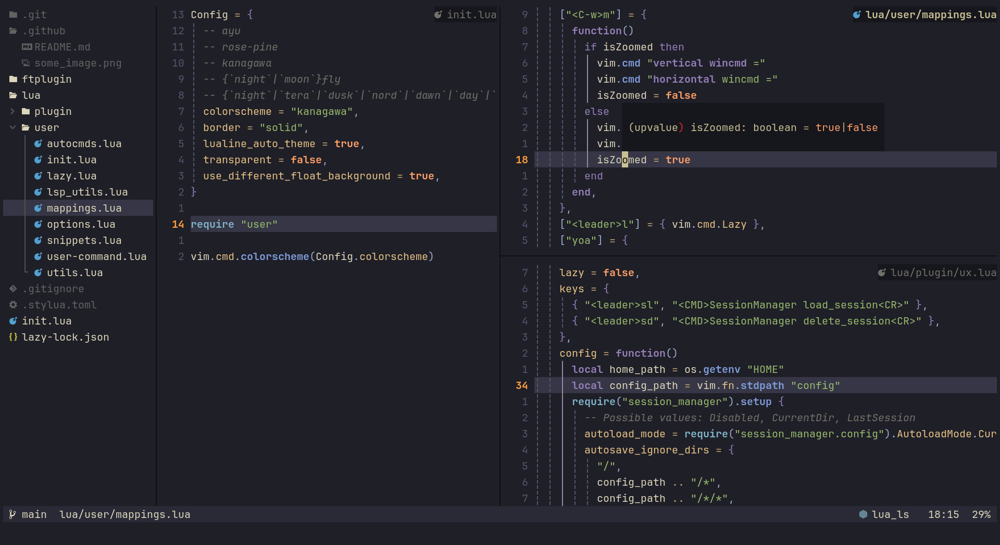

<h1 align="center">
My Neovim Config
</h1>



<p align="center">
looks like this
</p>

1. clone the config.

   ```bash
   git clone --depth 1 https://github.com/phdhary/neovim-config.git\
    ~/.config/nvim
   ```

2. run neovim.

   ```bash
   nvim
   ```

3. (optional) remove `/.git` to make it your own.

   ```bash
   rm -rf ~/.config/nvim/.git
   ```
